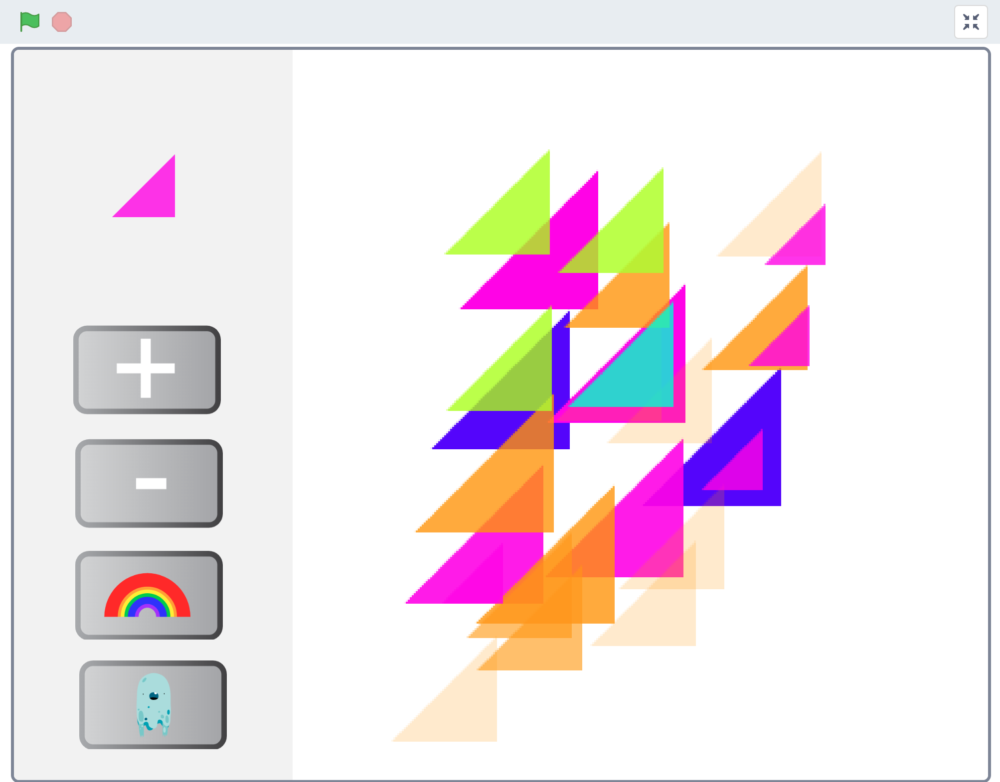

## Introduction
You're going to create an app for family and friends to use to design a picture or pattern. Using a menu, they will select and adapt images and/or shapes which you will provide to use in the design area of your app. You will choose the theme of the app.

## Skills you should have
To complete this Stamping app project you need to have the following skills which you will have learnt when completing [Fruit salad](https://learning-admin.raspberrypi.org/en/projects/bfruit-salad):
+ How to use `broadcast`{:class="block3events"} and `when I receive`{:class="block3events"} blocks to communicate between different sprites and between the stage and a sprites.
+ How to use the `Pen`{:class="block3extensions"} extension to `stamp`{:class="block3extensions"} sprites
+ How to add code to the Stage

You will now apply these skills to create your own project where you will choose your own sprites, costumes and Backdrop to create a unique app.

## What you will make
--- no-print ---
Click on the green flag to see an example project:

  <iframe allowtransparency="true" width="485" height="402" src="https://scratch.mit.edu/projects/embed/411774542/?autostart=false" frameborder="0"></iframe>

--- /no-print ---

--- print-only ---
{:width="400px"}
--- /print-only ---

--- collapse ---
---
title: What you will need
---
### Hardware

+ A computer or tablet capable of running Scratch

### Software

+ Scratch 3.0 (either [online](http://rpf.io/scratchon) or [offline](http://rpf.io/scratchoff))

--- /collapse ---

--- collapse ---
---
title: What you will learn
---

+ How to experiment between code and design to reach the best results
+ How to improve a user's experience of my project 
+ How to add comments to my code to help me and others with development

--- /collapse ---

--- collapse ---
---
title: Additional information for educators
---

If you need to print this project, please use the [printer-friendly version](https://projects.raspberrypi.org/en/projects/stamping-app/print){:target="_blank"}.

--- /collapse ---
